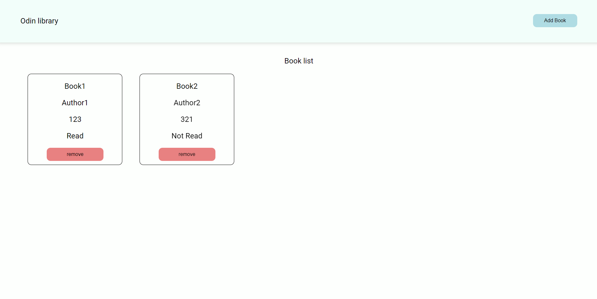

# Odin_library

URL: https://yongki95.github.io/odin_library/

### Used Skills

1. HTML

2. CSS

3. JavaScript

### Description
A website that can add books that you read, you will read, you are reading.

### Future Works

1. Add button that makes user to change progress of reading books.

2. Add color for "read" and "not read".

